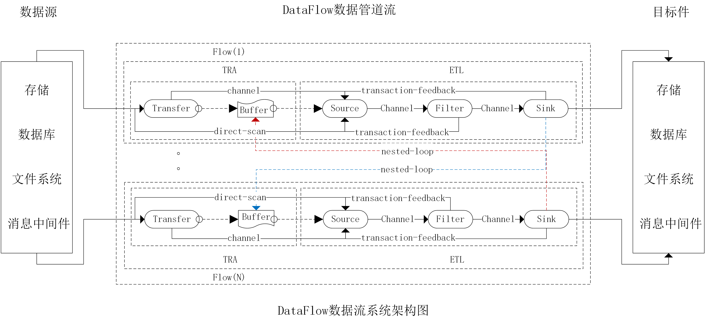

### 产品开发背景  
DataFlow是基于应用数据流程的一套分布式ETL系统服务组件，其前身是LogCollector2.0日志系统框架，自LogCollector3.0版本开始正式更名为DataFlow3.0。目前常用的ETL工具Flume、LogStash、Kettle、Sqoop等也可以完成数据的采集、传输、转换和存储；但这些工具都不具备事务一致性。比如Flume工具仅能应用到通信质量无障碍的局域网环境，在公网环境下可能因网络不稳定等因素导致连接远端服务的发送器组件失败，而此时收集器组件可能并不知情，数据仍然会继续传送到通道组件，这容易导致通道组件内存泄露从而引发OOM错误；另一方面由于通道错误导致实时收集的数据发送失败，收集器也没有记录实时检查点，这意味着发送失败的数据将面临丢失。发生所有这些问题的根源在于公网传递数据的不稳定性所致，因此Flume是一款仅能适用于云域内网的ETL工具。在这种问题背景的需求驱动下产生了DataFlow这款产品，DataFlow完全按照产品级标准使用JAVA语言进行开发，安装时无需再安装外置JDK支持，解压开箱即用。  
​      
      

### 产品功能特性  
DataFlow是基于应用数据流程的一套ETL系统服务组件，同时适用于云域内网数据传送和跨云数据传送；同时支持多维流程和嵌套流程并发运行；同时支持Windows和Linux双系统平台；同时支持实时传送、离线传送和断点续传；同时支持组件化、服务化、扩展化和集成化；产品可一键安装、分布式部署，自动识别平台和系统环境并完成相应配置，无需任何附加操作，解压开箱即用。  
​      

### 系统架构原理  
数据流系统DataFlow由调度器、装载器、编译器和执行器等系统核心组件构建；同时结合可插拔的转存器（Transfer）、收集器（Source[Manual、Realtime]）、过滤器（Filter）和发送器（Sink）等插件实现功能和模块化扩展，系统架构示意图如下：  
​      
​      
&#8203;
&#8203;
  
&#8203;
​      

##### 说明：  
1. 插件类型分为转存插件Transfer、收集器插件Source、过滤器插件Filter、发送器插件Sink；任何一个流程的数据流向都是从收集器经过过滤器抵达发送器后被发送出去的。这三个插件在任何流程中都是必不可少的插件，如果需要对接实时数据则通常需要在收集器前端置入转存器。
2. Source插件分为常规Source插件、离线Manual插件和实时Realtime插件。常规Source插件不区分是否为离线还是实时，通常这类插件同时实现了离线和实时功能；离线Manual插件提供离线批量扫描和并发扫描功能，用于离线场景下批量并发收集大量数据的情况；实时Realtime插件用于串行扫描缓冲文件或指定磁盘文件，通过记录检查点和偏移量实现断点续传。  
3. 过滤器插件目前有默认过滤器DefaultFilter和扩展过滤器ExtendFilter，前者用于过滤普通的空串及空白字符后直接透传到下游的发送器通道；后者是扩展的过滤器（同时也具备DefaultFilter的透传功能），该过滤器被设计为通用的过滤器，可以自定义运行时JAVA脚本来实现数据格式转换及过滤操作等。由于过滤器已经通用化，且它处于流程的中间环节，与边界之外的组件对接无关，故我们通常无需再定义任何过滤器。  
4. 发送器插件用于将收集器收集后并经过滤器转换过滤后的数据发送到目标中间件、数据库或存储，也可以将其发送到DataFlow系统内部的另一个ETL流程上，甚至可以将其发送到另一个DataFlow系统中的某一个流程中去。    
5. 流程实例内部任何一个插件中断都将导致该插件所在的整个流程被中断，这是线程间的分布式事务为保证数据安全性和数据一致性所作出的链式反馈结果。请注意，插件运行异常是导致插件所在的整个流程被中断，与该插件无关的其它流程并不会受到任何影响，因为DataFlow框架被设计成可支持多维流程，各插件应用通过线程隔离、各流程通过部署的命名空间隔离。  
   
##### 备注：  
我们可以针对不同的对接组件（如：Redis、MySql、MongoDB等等）扩展出不同类型的具体插件应用（如：FileTransfer、RedisTransfer、MySqlSource、RedisSink、MongoSink等等），在一个定义好的DataFlow系统框架内，插件类之间的数据传递流程为：  
1. 非转存模式  
Source—>Filter—>Sink  
2. 转存模式  
Transfer—>Source—>Filter—>Sink  

​      

### 同类产品对比  
##### 1. DataFlow VS Kettle  
Kettle框架不具备通过事务反馈达到数据一致性能力，DataFlow框架具备  
Kettle框架不支持复杂嵌套子流程、不支持闭环流程，DataFlow框架具备  

##### 2. DataFlow VS Flume：
Flume框架不具备通过动态脚本定制规则的扩展功能，DataFlow框架具备  
Flume框架不具备通过事务反馈达到数据一致性能力，DataFlow框架具备  
Flume框架不支持复杂嵌套子流程、不支持闭环流程，DataFlow框架具备  

##### 3. DataFlow VS LogStash：
LogStash框架不支持复杂嵌套子流程、不支持闭环流程，DataFlow框架具备  
LogStash框架不具备通过动态脚本定制规则的扩展功能，DataFlow框架具备  
LogStash框架不具备通过插件动态横向扩展功能的能力，DataFlow框架具备  

##### 4. DataFlow VS Sqoop：
Sqoop框架不支持复杂多维流程、嵌套流程以及闭环流程，DataFlow框架具备  
Sqoop框架不具备通过动态脚本定制过滤规则的扩展功能，DataFlow框架具备  
Sqoop框架不具备通过插件动态横向扩展功能模块的能力，DataFlow框架具备  
Sqoop框架不具备通过事务反馈回滚达到数据一致性能力，DataFlow框架具备  
Sqoop框架不支持复杂嵌套子流程、不支持高级闭环流程，DataFlow框架具备  
​      
      

### 产品安装部署  
1. 下载与安装  
wget https://github.com/lixiang2114/Approval3/raw/main/DataFlow-3.0.zip -P /install/zip/    
unzip /install/zip/DatFlow-3.0.zip -d /software/  
##### 备注：  
本套产品支持在Windows系统上安装部署和使用，在Windows上的安装和Linux上的安装类同，都是解压即用模式，如：解压到D盘根目录可以执行： unzip DatFlow-3.0.zip -d  D:/software/  

##### 特别声明:  
DataFlow3.0是数据流框架发展进程中的一个里程碑，后续的功能化插件扩展都是基于该版本稳定向前兼容的，之前的LogCollector3.0版本与DataFlow3.0的内核是同一个版本，这是一种平滑过渡，其目的旨在于避免生产环境数据中台系统架构在更新迭代中不至于太过陡峭。  
​      

2. 配置DataFlow  
```Shell
vi /etc/profile
DATAFLOW_HOME=/software/DataFlow-3.0
PATH=$PATH:$DATAFLOW_HOME/bin
export PATH DATAFLOW_HOME  
```
​      

### 安装目录介绍  
|目录名称|目录介绍|备注说明|
|:-----:|:-------:|:-------:|
|bin|二进制脚本及可执行文件|用于启停TRA服务/ETL服务、执行检查点等|
|sys|系统平台核心运行库路径|用以支撑不同系统平台的运行时环境，不能变动或改变|
|lib|系统应用核心支撑库路径|系统运行时依赖所必须，若没有特别理由，不要去改变|
|conf|系统上下文及其日志配置|全局服务参数、应用上下文参数和系统级日志配置参数|
|logs|系统应用运行时日志路径|若服务无法启动或系统启动错误，可通过系统日志进行排查|
|flows|系统流程实例运行时目录|一个流程对应一个目录，该目录中插件支持缓存和运行时生成|
|plugins|系统流程应用插件安装目录|插件服务于流程，可通过自定义和安装插件来扩展本系统功能|

​      
### BIN目录脚本说明    
凡是以cmd结尾的脚本文件都是Windows系统上使用的脚本，凡是以sh结尾的脚本文件都是Linux系统上使用的脚本，以下仅提及脚本文件名称，除非特别说明，否则不再区分不同的系统平台  
|脚本文件|功能介绍|备注说明|
|:-----:|:-------:|:-------:|
|status|系统服务状态脚本|查看系统服务状态|
|startup|系统服务启动脚本|用于启动系统服务|
|shutdown|系统服务停止脚本|用于平滑停止系统服务|
|loadAllFlows|所有流程挂载脚本|用于装载所有流程实例和上下文|
|startAllFlows|流程实例启动脚本|用于启动流程上下文中的所有流程实例|
|initAllFlows|所有流程初始化脚本|用于装载并启动所有流程实例及上下文|
|forceShutdown|系统服务强制停止脚本|直接使用kill命令强制杀掉系统框架服务|

​    
### CONF目录配置说明    
|配置文件|功能介绍|备注说明|
|:-----:|:-------:|:-------:|
|application.yml|系统服务配置|配置绑定IP、端口、日志路径等|
|context.properties|系统应用配置|配置应用上下文参数、流程实例参数等|
|logback-spring.xml|系统日志配置|配置上下文日志参数、流程日志参数、插件日志参数等|
​    
### LOGS目录日志说明    
|日志文件|功能介绍|备注说明|
|:-----:|:-------:|:-------:|
|pid|JVM系统例程ID文件|脚本用来关闭例程、平滑关闭时被自动删除|
|flow.log|流程实例运行时日志|流程实例启停日志、运行日志和插件日志等|
|server.log|系统服务运行时日志|系统服务启停日志、管理日志和访问日志等|
​    
### PLUGINS目录插件说明    
|插件名称|插件介绍|备注说明|
|:-----:|:-------:|:-------:|
|fileSink|本地文件发送器|用于将通道接收到的文本数据持久化到本地文件系统|
|httpSink|Web服务发送器|用于将通道接收到的数据发送到Web服务器，支持认证和会话跟踪|
|mqttSink|Mqtt服务发送器|用于将通道接收到的数据发送到Mqtt服务器，支持认证和会话跟踪|
|defaultFilter|ETL通道默认过滤器|用于接收上游通道文本数据，并将其过滤后的文本发送到下游通道|
|fileManual|本地文件离线收集器|用于离线读取本地文件系统中的文本数据，并将其发送到下游通道|
|fileRealtime|本地文件实时收集器|用于实时读取本地文件系统中的文本数据，并将其发送到下游通道|
|mongoSink|MongoDB服务发送器|用于将通道接收到的数据发送到MongoDB服务器，支持认证和会话跟踪|
|httpTransfer|Web服务实时转存器|用于实时读取Web端口数据，并将其转存到本地目录或发送到下游通道|
|mqttTransfer|Mqtt服务实时转存器|用于实时读取Mqtt端口数据，并将其转存到本地目录或发送到下游通道|
|fileTransfer|本地文件实时转存器|用于实时读取本地系统数据，并将其转存到本地目录或发送到下游通道|
##### 备注：  
更多插件介绍请参考插件库：https://github.com/lixiang2114/DataFlow-Plugins
​    
### 应用流程设计    
应用流程又称为流程实例，属于抽象流程定义的一个具体应用，应用流程的名称可以自由定义，但必须遵循框架的设计规范（在后续的流程定义范例中有说明）。流程实例的设计原则是在满足业务需求的前提下尽量做到安全、高效、紧凑、易用。  
        
#### 范例设计举例  
比如我们需要在服务器本地实现应用日志的实时同步过程（即将服务器的日志实时同步到本地的另一个目录下，这个目录可能存在于当前服务器的另一个磁盘上）  
      
过程分析：  
不可以使用FileRealtime直接对接应用产生的日志文件，因为应用产生的日志文件为应用系统所维护，比如日志文件会按照应用日志框架的设定发生滚动切换、重命名等，这容易导致FileRealtime抛出文件找不到的磁盘级IO异常，一旦发生异常，不仅ETL流程被中断，同时数据也会发生丢失。  
不可以选择基于本地文件的插件FileManual，应该该插件是离线收集插件，不会记录状态和检查点，一旦流程中某个插件运行发生异常导致流程中断后，后续将无法从上次拉取数据的位置继续拉取数据，如果从头重新拉取又会使得拉取数据的重复。  

设计思路：  
设计的流程实例名称可以定义为fileToFile（即从本地文件到本地文件的拷贝），由于对接的文件是应用系统产生的日志文件，日志文件中的数据是实时产生的，为保证不发生同步日志丢失，同时保证不发生日志的重复收集，我们应该在此流程实例中置入基于本地文件的转存插件FileTransfer，该插件可以实时收集应用产生的日志数据并将其缓冲到ETL流程中去。收集器插件应该选择FileRealtime用于实时收集缓冲到ETL流程的数据并实时记录收集位置（数据记录偏移量）到检查点（检查点可以使得流程在重启后自动断点续传）。过滤器插件根据情况可以选择DefaultFilter（直接透传）或ExtendFilter（需要增加脚本转换、过滤等）；发送器插件可以选择基于本地文件的FileSink即可。  

##### 备注：  
如果需要将上述收集的日志同步到关系数据库MySql（而不是本地文件），那么我们的发送器插件可以选择MySqlSink即可；同样的道理，如果需要实时收集Redis中间件的数据可以选择RedisTranser、如果需要离线收集ElasticSearch存储的数据可以选择ElasticSource、收集MongoDB中的数据可以选择MongoSource插件等等...  
      
#### 定义流程目录及配置文件  
```Shell
#在系统安装目录下的flows子目录下创建流程目录
mkdir -p $DATAFLOW_HOME/flows/fileToFile
#在流程目录下创建流程参数配置文件,文件名与目录名一致
touch $DATAFLOW_HOME/flows/fileToFile/fileToFile.properties
```
##### 备注：  
流程名称为自定义（虽然为自定义，但应该尽可能做到见名知意），根据系统框架接口规范的约定原则，流程名称与流程目录名称（fileToFile）以及流程目录下的流程配置文件名（fileToFile.properties）必须保持一致，否则系统框架无法装载流程实例，从而导致流程无法启动。  

#### 设计流程并配置流程参数  
```Shell
vi $DATAFLOW_HOME/fileToFile/fileToFile.properties
#定义发送器插件
sink=fileSink
#定义过滤器插件
filter=defaultFilter
#定义收集器插件
source=fileRealtime
#定义转存器插件
transfer=fileTransfer
#不清空缓存插件
clearCache=false
#流程为实时ETL流程
realTime=true
```
##### 备注：  
应用流程的配置取决于流程实例的设计，而流程实例的设计源自于业务系统的需求定义；根据系统框架的运行机制，各种不同类型的流程之间可以任意组合以实现不同的业务控制，比如我们可以借助于FlowSink插件来串接需要的子流程以实现复合流程嵌套的目的。  

#### 挂载流程并配置到数据流系统  
```Shell
vi $DATAFLOW_HOME/conf/context.properties
#系统服务启动时装载并启动所有流程实例
initOnStart=true
#系统服务启动时装载的流程列表,多个流程之间使用英文逗号","分隔
flowList=fileToFile
```
##### 特别说明:  
流程初始化时将发生流程挂载，流程挂载时将拷贝流程引用的所有插件目录到流程目录下，其目的是实现基于流程实例空间的数据隔离；在系统安装目录下的flows目录下预置了一些流程，这些流程可以直接使用，也可以根据自己的业务系统需求酌情修改配置以适应自己的流程设计需要。若将initOnStart参数设置为false，则执行startup脚本后仅启动系统，而不会挂载和启动流程实例，此时可以手动部署流程实例，部署完流程实例后再执行initAllFlows脚本（或依次执行loadAllFlows和startAllFlows脚本）挂载并启动所有部署的流程。  

​    
### 应用插件开发    
上述应用插件可以在插件库中找到，插件的下载地址为：https://github.com/lixiang2114/DataFlow-Plugins  
所有的DataFlow插件都是前后兼容的，如果你在插件库中没有找到你需要的插件，那么强烈建议你自行开发并贡献插件到此插件库中，以便于其它有跟你具有相同需求的人也能使用你写的插件，下面是讲解DataFlow插件的开发过程。   
​    
#### 发送器Sink插件开发步骤  
1. 创建Maven工程并引入以下依赖项
```Text
<dependency>
    <groupId>com.github.lixiang2114.flow</groupId>
    <artifactId>DataFlow</artifactId>
    <version>3.0</version>
    <scope>provided</scope>
</dependency>
```
##### 备注:  
DataFlow依赖库可以从下面的地址下载:  
wget https://github.com/lixiang2114/DataFlow/raw/main/target/DataFlow-3.0.jar  
​    
2. 编写插件接口实现类FileSink
```JAVA
package com.lc.plugin.sink.file;

import java.io.File;
import org.slf4j.Logger;
import org.slf4j.LoggerFactory;
import com.github.lixiang2114.flow.comps.Channel;
import com.lc.plugin.sink.file.config.FileConfig;
import com.lc.plugin.sink.file.service.FileService;
import com.github.lixiang2114.flow.plugins.adapter.SinkPluginAdapter;

/**
 * @author Lixiang
 * @description File发送器
 */
public class FileSink extends SinkPluginAdapter{
	/**
	 * 文件写出配置
	 */
	private FileConfig fileConfig;
	
	/**
	 * 文件服务配置
	 */
	private FileService fileService;
	
	/**
	 * 日志工具
	 */
	private static final Logger log=LoggerFactory.getLogger(FileSink.class);
	
	@Override
	public Boolean init() throws Exception {
		log.info("FileSink plugin starting...");
		File confFile=new File(pluginPath,"sink.properties");
		if(!confFile.exists()) {
			log.error(confFile.getAbsolutePath()+" is not exists...");
			return false;
		}
		
		this.fileConfig=new FileConfig(flow).config();
		this.fileService=new FileService(fileConfig);
		
		return true;
	}

	@Override
	public Object send(Channel<String> filterToSinkChannel) throws Exception {
		log.info("FileSink plugin handing...");
		if(flow.sinkStart) {
			log.info("FileSink is already started...");
			return true;
		}
		
		flow.sinkStart=true;
		
		try{
			String message=null;
			while(flow.sinkStart) {
				if(null==(message=filterToSinkChannel.get())) continue;
				if(!fileService.writeMessage(message)) return false;
			}
		}catch(Exception e){
			log.warn("sink plugin is interrupted while waiting...");
		}
		
		return true;
	}
	
	@Override
	public Object stop(Object params) throws Exception {
		flow.sinkStart=false;
		fileService.stop();
		return true;
	}

	@Override
	public Object config(Object... params) throws Exception{
		log.info("FileSink plugin config...");
		if(null==params || 0==params.length) return fileConfig.collectRealtimeParams();
		if(params.length<2) return fileConfig.getFieldValue((String)params[0]);
		return fileConfig.setFieldValue((String)params[0],params[1]);
	}
}
```
##### 备注：  
插件的名称可以自定义，但需要和接口配置文件名保持一致；开发发送器Sink插件一般需要继承适配器SinkPluginAdapter类，然后实现其中的虚方法，上面编写了接口实现类(即：插件入口类)，其余类可根据插件实现需求酌情定义，本处略。  
​    

3. 编译打包插件工程  
```Shell
#切换到插件所在工程目录下
cd $ProjectHome/  
#编译打包插件工程,打包后的归档文件在$ProjectHome/target目录下生成
mvn clean compile package -Dmaven.test.skip=true  
```
​    
4. 安装并配置插件目录  
* 创建插件目录和配置文件
```Shell
source /etc/profile  
#此目录结构是固定的
mkdir -p $DATAFLOW_HOME/plugins/fileSink/lib  
#文件名sink.properties是Sink插件的专用名,不可更改
touch $DATAFLOW_HOME/plugins/fileSink/sink.properties
#文件名fileSink.properties必须与插件目录一致,不可更改
touch $DATAFLOW_HOME/plugins/fileSink/fileSink.properties
#拷贝打包后的插件归档文件到创建的lib目录下
cp -a $ProjectHome/target/FileSink-1.0.jar $DATAFLOW_HOME/plugins/fileSink/lib/
```
* 编写插件接口配置文件
```Properties
vi $DATAFLOW_HOME/plugins/fileSink/fileSink.properties
#插件依赖的第三方包路径
classPath=lib
#系统调用插件的入口引导类
bootType=com.lc.plugin.sink.file.FileSink
```
* 编写插件应用配置文件  
```Properties
vi $DATAFLOW_HOME/plugins/fileSink/sink.properties
#持久化到本地文件系统的文件全名
filePath=/install/test/log-test/dest/dest.log
#单个文件最大尺寸,超过这个阈值则滚动生成新文件
maxFileSize=100MB
#最大历史文件数量，超过这个阈值则删除旧的历史文件
maxHistory=1

备注:
本配置文件需要根据插件应用本身的需求来进行参数配置
```
##### 备注：  
插件目录下可以根据插件本身的需求酌情创建其它目录和编写其它配置文件，这个完全取决于插件本身的需求，与系统框架DataFlow无关；插件库路径目录名lib针对所有插件都是固定的，不能修改，应用配置文件名sink.properties针对所有的Sink发送器插件都是固定的（如果是Source收集器插件则变成source.properties，以此类推...）；而根据系统级约定规则，接口配置文件fileSink.properties的文件名fileSink必须与插件目录同名，否则日志系统框架DataFlow将找不到插件接口配置，从而造成系统框架在运行时无法装载插件。  
##### 特别说明:  
上述介绍的是Sink发送器插件的开发和安装流程，其余类型的插件开发安装流程与之相同，只是第二步实现接口略有差异，下面仅介绍其它类型插件的接口实现示例。  
​    
#### 转存器Transfer插件接口实现示例  
```JAVA
package com.lc.plugin.transfer.file;

import java.io.File;
import org.slf4j.Logger;
import java.io.IOException;
import org.slf4j.LoggerFactory;
import com.github.lixiang2114.flow.comps.Channel;
import com.lc.plugin.transfer.file.config.FileConfig;
import com.lc.plugin.transfer.file.service.FileService;
import com.github.lixiang2114.flow.plugins.adapter.TransferPluginAdapter;

/**
 * @author Lixiang
 * @description 基于文件系统的Transfer插件
 */
public class FileTransfer extends TransferPluginAdapter {
	/**
	 * FileTransfer配置
	 */
	private FileConfig fileConfig;
	
	/**
	 * FileService服务组件
	 */
	private FileService fileService;
	
	/**
	 * 日志工具
	 */
	private static final Logger log=LoggerFactory.getLogger(FileTransfer.class);
	
	@Override
	public Boolean init() throws Exception {
		log.info("FileTransfer plugin starting...");
		File confFile=new File(pluginPath,"transfer.properties");
		if(!confFile.exists()) {
			log.error(confFile.getAbsolutePath()+" is not exists...");
			return false;
		}
		
		this.fileConfig=new FileConfig(flow).config();
		fileService=new FileService(fileConfig);
		
		return true;
	}
	
	@Override
	public Object transfer(Channel<String> transferToSourceChannel) throws Exception {
		log.info("FileTransfer plugin starting...");
		if(flow.transferStart) {
			log.info("FileTransfer is already started...");
			return true;
		}
		
		flow.transferStart=true;
		return fileService.startLogTransferSave(transferToSourceChannel);
	}
	
	@Override
	public Object stop(Object params) throws Exception {
		return fileService.stopLogTransferSave(params);
	}

	@Override
	public Object config(Object... params) throws Exception {
		log.info("FileTransfer plugin config...");
		if(null==params || 0==params.length) return fileConfig.collectRealtimeParams();
		if(params.length<2) return fileConfig.getFieldValue((String)params[0]);
		return fileConfig.setFieldValue((String)params[0],params[1]);
	}

	/**
	 * 刷新日志文件检查点
	 * @throws IOException
	 */
	@Override
	public Object checkPoint(Object params) throws Exception{
		log.info("FileTransfer plugin reflesh checkpoint...");
		fileConfig.refreshCheckPoint();
		return true;
	}
}
```
##### 特别说明:  
转存器在流程实例中是可选插件，并不是必须的；在某些流程中，如果存在于存储（而非消息中间件）或允许数据存在一定程度上的丢失，则可以使用Source插件直接对接应用数据源。  

#### 过滤器Filter插件接口实现示例  
```JAVA
package com.lc.plugin.filter;

import org.slf4j.Logger;
import org.slf4j.LoggerFactory;
import com.github.lixiang2114.flow.comps.Channel;
import com.github.lixiang2114.flow.plugins.adapter.FilterPluginAdapter;

/**
 * @author Lixiang
 * @description 默认过滤器
 */
public class DefaultFilter extends FilterPluginAdapter{
	/**
	 * 日志工具
	 */
	private static final Logger log=LoggerFactory.getLogger(DefaultFilter.class);

	@Override
	public Object filter(Channel<String> sourceToFilterChannel,Channel<String> filterToSinkChannel) throws Exception{
		log.info("DefaultFilter plugin filtering...");
		if(flow.filterStart) {
			log.info("DefaultFilter is already started...");
			return true;
		}
		
		flow.filterStart=true;
		try{
			String message=null;
			while(flow.filterStart) {
				if(null==(message=sourceToFilterChannel.get())) continue;
				filterToSinkChannel.put(message);
			}
		}catch(InterruptedException e){
			log.warn("filter plugin is interrupted while waiting...");
		}
		
		return true;
	}

	@Override
	public Object stop(Object params) throws Exception {
		flow.filterStart=false;
		return true;
	}
}
```
##### 特别说明:  
上述是系统提供的默认过滤器实现，它没有对数据做任何转换和过滤操作，仅仅是将上游通道的数据读取出来推送到下游通道；如果需要转换或过滤数据则需要针对不同的业务编写不同的过滤器，而不是直接使用系统提供的默认过滤器，此过程可通过扩展过滤器ExtendFilter来完成。  

#### 收集器Source插件接口实现示例  
```JAVA
package com.lc.plugin.source.rt.file;

import java.io.File;
import org.slf4j.Logger;
import java.io.IOException;
import org.slf4j.LoggerFactory;
import com.github.lixiang2114.flow.comps.Channel;
import com.lc.plugin.source.rt.file.config.FileConfig;
import com.lc.plugin.source.rt.file.service.FileService;
import com.github.lixiang2114.flow.plugins.adapter.RealtimePluginAdapter;

/**
 * @author Lixiang
 * @description 基于文件系统的实时Source插件
 */
public class FileRealtime extends RealtimePluginAdapter {
	/**
	 * FileRealtime配置
	 */
	private FileConfig fileConfig;
	
	/**
	 * FileService服务组件
	 */
	private FileService fileService;
	
	/**
	 * 日志工具
	 */
	private static final Logger log=LoggerFactory.getLogger(FileRealtime.class);
	
	@Override
	public Boolean init() throws Exception {
		log.info("FileRealtime plugin starting...");
		File confFile=new File(pluginPath,"source.properties");
		if(!confFile.exists()) {
			log.error(confFile.getAbsolutePath()+" is not exists...");
			return false;
		}
		
		this.fileConfig=new FileConfig(flow).config();
		fileService=new FileService(fileConfig);
		
		return true;
	}

	@Override
	public Object handle(Channel<String> transferToETLChannel, Channel<String> sourceToFilterChannel) throws Exception {
		log.info("FileRealtime plugin starting...");
		if(flow.sourceStart) {
			log.info("FileRealtime is already started...");
			return true;
		}
		
		flow.sourceStart=true;
		return fileService.startRealtimeETLProcess(sourceToFilterChannel);
	}
	
	@Override
	public Object stop(Object params) throws Exception {
		flow.sourceStart=false;
		return true;
	}

	@Override
	public Object config(Object... params) throws Exception {
		log.info("FileRealtime plugin config...");
		if(null==params || 0==params.length) return fileConfig.collectRealtimeParams();
		if(params.length<2) return fileConfig.getFieldValue((String)params[0]);
		return fileConfig.setFieldValue((String)params[0],params[1]);
	}

	/**
	 * 刷新日志文件检查点
	 * @throws IOException
	 */
	@Override
	public Object checkPoint(Object params) throws Exception{
		log.info("FileRealtime plugin reflesh checkpoint...");
		fileConfig.refreshCheckPoint();
		return true;
	}
}
```
##### 特别说明:  
上述介绍的是实时Source插件的接口实现，离线Source插件的接口实现与之类同，此处略。为保证实时流程的健壮性，我们通常都需要基于本地文件系统的实时Source插件支持。如果不需要为转换数据格式而编写过滤器（当考虑需要编写过滤器时请先考虑是否可以直接使用通用的扩展过滤器ExtendFilter来满足这一需求），那么可直接使用系统提供的默认过滤器（DefaultFilter）。因此，在大多数情况下，我们为设计流程而编写的插件通常是Transfer转存器插件、Source收集器插件和Sink发送器插件。  